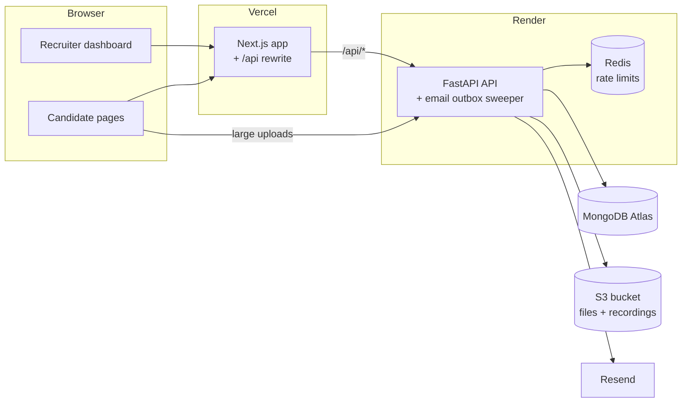

<div align="center">

# RECRUIT.AI

**A recruitment pipeline for college clubs and small teams: publish a drive, collect applications and task submissions, run a structured interview, and decide, all in one place.**

[](https://nextjs.org/)
[](https://fastapi.tiangolo.com/)
[](https://www.mongodb.com/)
[](https://www.typescriptlang.org/)
[](https://www.python.org/)

[Live site](https://recruitai.shouryaparashar.in) · [Report a bug](https://github.com/im-shourya/RECURIT.AI/issues)

</div>

---

## Contents

- [What it does](#what-it-does)
- [Current limitations](#current-limitations)
- [How it works](#how-it-works)
- [Tech stack](#tech-stack)
- [Getting started](#getting-started)
- [Project structure](#project-structure)
- [API](#api)
- [Testing](#testing)
- [Deployment](#deployment)
- [Environment variables](#environment-variables)
- [Contributing](#contributing)

---

## What it does

An organisation creates a **recruitment drive** and shares its link or QR code.
Candidates apply without making an account. From there the drive runs through
a fixed pipeline, and a recruiter makes every hiring decision.

**For recruiters**

- **Drives:** create, edit, open and close drives. Each drive gets a public apply link and a QR code, and is either *task-based* (candidates submit work) or *GitHub-based* (candidates give a repository URL when they apply).
- **Candidate review:** filter, search and page through applicants, read submissions, download uploaded files, watch interview recordings, and read transcripts.
- **Interview checkpoint:** a submitted candidate is only interviewed if a recruiter invites them.
- **Decisions:** select or reject one candidate or up to 100 at once. The candidate is emailed the outcome.
- **Teams and roles:** owner, admin and member. Members can review but not decide. The API enforces roles; the interface only reflects them.
- **Audit trail:** decisions, interview invitations, erasures, drive creation, edits, opening, closing and deletion, membership changes and password changes are all recorded.
- **Analytics:** applicant counts per status, per drive and over time.
- **Data rights:** CSV export, per-candidate erasure (including stored files), and whole-account deletion.

**For candidates**

- A single apply form, then one private link that shows their progress and deadlines, and where they submit task work (files up to 10MB).
- A browser-based interview with camera recording.

**Email.** Application received, task assigned, interview invitation, result
and password reset are sent through [Resend](https://resend.com). Mail goes
through a database outbox and is retried, so it isn't lost if a send fails.

## Current limitations

Some earlier descriptions of this project promised more than the code does.
Here is what the code actually does today. Each gap is tracked as an issue.

| Area | Today | Issue |
|:-----|:------|:-----:|
| Interview questions | Nine fixed questions across three rounds (intro, project, domain). Nothing is generated per candidate. | [#44](https://github.com/im-shourya/RECURIT.AI/issues/44) |
| Scoring | Counts how many answers were given in each round. It does not read what they say. | [#45](https://github.com/im-shourya/RECURIT.AI/issues/45) |
| Proctoring | No face or gaze detection. The interview is recorded, and a recruiter can watch it. | [#46](https://github.com/im-shourya/RECURIT.AI/issues/46) |
| GitHub analysis | `aiml/GitAnalyser` is a working standalone service, but the platform never calls it. | [#47](https://github.com/im-shourya/RECURIT.AI/issues/47) |
| Speech | Answers are typed. There is no speech recognition or synthesis. | [#62](https://github.com/im-shourya/RECURIT.AI/issues/62) |

Treat interview scores as placeholders, not an assessment.

---

## How it works



The browser always calls `/api/*` on the frontend's own origin, and Next.js
forwards those calls to the API. This keeps the session cookie first-party
(see [Sessions](backend/README.md#sessions)). The only exception is the two
large candidate uploads, which go straight to the API.

### A candidate's path through a task drive

```
applied ──▶ task_sent ──▶ submitted ──(recruiter invites)──▶ interview_sent ──▶ interviewed ──▶ selected / rejected
```

1. The candidate applies through the drive link and is emailed the task, along with a private link for status and submission.
2. They submit work before the task deadline, while the drive is still open.
3. A recruiter reviews the work and either invites them to interview or decides straight away.
4. The candidate takes the interview in the browser. It is recorded and saved, and the organisation is notified.
5. An admin selects or rejects. The candidate is emailed the result.

On a GitHub drive the repository URL is part of the application, so step 2
doesn't exist and the interview invitation is sent when they apply.

---

## Tech stack

| Layer | Technology |
|:------|:-----------|
| Frontend | Next.js 16 (App Router), React 19, TypeScript, Tailwind CSS 4, shadcn/ui on Radix, Framer Motion, Recharts |
| Backend | FastAPI, Beanie ODM on Motor (MongoDB), Pydantic v2, python-jose (JWT), bcrypt, boto3, qrcode |
| Data | MongoDB (Atlas in production), Redis for shared rate-limit counters (optional) |
| Files | Any S3-compatible bucket, with private objects served through short-lived signed links |
| Email | Resend, with versioned templates in `backend/app/services/email_templates.py` |
| Hosting | Vercel (frontend), Render (API + Redis) |
| GitAnalyser | Separate FastAPI service using Gemini, SQLite and WebSocket progress, deployable to Railway (not connected, see above) |

---

## Getting started

### Prerequisites

- **Node.js 20.9+** (required by Next.js 16)
- **Python 3.10+**
- **MongoDB.** Either use `docker compose` (below) to run it locally, or use a free [MongoDB Atlas](https://www.mongodb.com/atlas) cluster.

Redis, S3 and Resend are optional locally:

- Without Redis, rate limits are counted in memory.
- Without S3, uploads return a clear `503`.
- Without Resend, emails are logged instead of sent.

### 1. Clone

```bash
git clone https://github.com/im-shourya/RECURIT.AI.git
cd RECURIT.AI
```

### 2. Start MongoDB and Redis

```bash
docker compose up -d
```

This only starts **MongoDB 7** on `localhost:27017` and **Redis 7** on
`localhost:6379`. It does not run the app itself. If you use Atlas instead,
skip this step.

### 3. Backend

```bash
cd backend
python3 -m venv venv
source venv/bin/activate          # Windows: venv\Scripts\activate
pip install -r requirements.txt

cp .env.example .env              # defaults work against the local MongoDB
uvicorn app.main:app --reload --port 8000
```

The API is at <http://localhost:8000>, and its interactive docs are at
<http://localhost:8000/docs>. There are no migrations. Indexes are created
when the app starts.

### 4. Frontend

In a second terminal, from the repository root:

```bash
cd frontend
npm install
cp .env.example .env.local        # points at http://localhost:8000
npm run dev
```

Open <http://localhost:3000>, register an organisation, and create a drive.

---

## Project structure

```
RECURIT.AI/
├── frontend/                  Next.js app
│   ├── app/
│   │   ├── (dashboard)/       Signed-in recruiter pages: drives, applicants,
│   │   │                      analytics, audit, team, settings
│   │   ├── auth/              Sign-in, registration, password reset
│   │   ├── apply/[token]/     Public application form
│   │   ├── submit/[token]/    Candidate task submission
│   │   ├── status/[token]/    Candidate's own progress page
│   │   └── interview/[token]/ Candidate interview
│   ├── components/            Landing sections and shadcn/ui components
│   ├── lib/api.ts             Typed API client
│   └── next.config.mjs        Security headers and the /api rewrite
│
├── backend/                   FastAPI API (see backend/README.md)
│   ├── app/
│   │   ├── routers/           auth, drives, applicants, applicant_admin,
│   │   │                      interviews, analytics, audit, team
│   │   ├── services/          auth, email + outbox, storage, cascade
│   │   │                      deletes, audit, rate limiting, QR codes
│   │   └── models/            Beanie documents and API schemas
│   ├── scripts/               One-off maintenance, e.g. the Postgres→Mongo migration
│   └── tests/                 pytest suite (runs against an in-memory MongoDB)
│
├── aiml/GitAnalyser/          Standalone repository-analysis service (not connected)
├── docker-compose.yml         Local MongoDB + Redis
└── render.yaml                Render blueprint for the API and Redis
```

---

## API

The full endpoint list, auth rules, file handling and email behaviour are in
**[backend/README.md](backend/README.md)**. A running API also serves
OpenAPI docs at `/docs`.

In short:

- **Organisation endpoints** (`/api/auth`, `/api/drives`, `/api/applicants`, `/api/team`, `/api/audit`, `/api/analytics`) authenticate with an httpOnly session cookie and check the caller's role.
- **Candidate endpoints** (`/api/apply`, `/api/submit`, `/api/status`, `/api/interview`) are reached through unguessable tokens in the URL and are rate-limited.

---

## Testing

```bash
cd backend
source venv/bin/activate
pip install -r requirements-dev.txt
python -m pytest -q
```

The suite uses `mongomock-motor`, so it runs real queries without a MongoDB
server.

For the frontend there is no test suite yet. The build type-checks the code:

```bash
cd frontend
npm run build
```

`npm run lint` is defined in `package.json` but ESLint isn't installed yet
([#78](https://github.com/im-shourya/RECURIT.AI/issues/78)). There is no CI yet
either ([#75](https://github.com/im-shourya/RECURIT.AI/issues/75)).

---

## Deployment

**API on Render.** [`render.yaml`](render.yaml) is a blueprint for the API and
a Redis instance. Connect the repository in the Render dashboard as a
Blueprint, then fill in the values marked `sync: false` (MongoDB URL, frontend
URL, CORS origins, Resend and S3 credentials). MongoDB is hosted on Atlas, not
Render. Outbound email is retried by a sweeper inside the web service, so no
separate worker is needed.

**Frontend on Vercel.** Import `frontend/` as a Next.js project. Set
`NEXT_PUBLIC_API_URL` to the Render API URL and `NEXT_PUBLIC_APP_URL` to the
public site URL. `NEXT_PUBLIC_API_URL` is read at **build** time by the `/api`
rewrite, so redeploy after you change it.

---

## Environment variables

`backend/.env.example` and `frontend/.env.example` are commented starting
points. `backend/app/config.py` holds every backend setting and its default.
These are the ones you are most likely to set:

### Backend (`backend/.env`)

| Variable | Required | Description |
|:---------|:--------:|:------------|
| `MONGODB_URL` | Yes | MongoDB connection string |
| `MONGODB_DB` | — | Database name (default `recruit_ai`) |
| `SECRET_KEY` | Production | Signs session tokens. In production it must be at least 32 characters and not a placeholder, or the API refuses to start (`openssl rand -hex 32`) |
| `ENVIRONMENT` | — | `production` turns on the startup checks and the `Secure` cookie |
| `ACCESS_TOKEN_EXPIRE_MINUTES` | — | Session lifetime (default `1440`) |
| `SESSION_COOKIE_SECURE` | — | Force the session cookie's `Secure` flag on or off (default: on only in production) |
| `FRONTEND_URL` | Yes | Base of every link emailed to candidates |
| `APP_URL` | — | Base for logo and footer links inside emails |
| `CORS_ALLOWED_ORIGINS` | Production | Exact frontend origins, comma-separated. `*` is rejected |
| `RESEND_API_KEY`, `RESEND_FROM_EMAIL` | For email | Without them, emails are logged instead of sent |
| `S3_BUCKET_NAME`, `S3_REGION`, `AWS_ACCESS_KEY_ID`, `AWS_SECRET_ACCESS_KEY` | For uploads | `S3_ENDPOINT_URL` for MinIO or other S3-compatible stores |
| `REDIS_URL` | — | Shared rate-limit counters. Without it, limits are counted per process |
| `TRUST_PROXY_HEADERS` | Behind a proxy | Read the client IP from `X-Forwarded-For` |
| `SENTRY_DSN` | — | Error tracking. Empty disables it |

### Frontend (`frontend/.env.local`)

| Variable | Required | Description |
|:---------|:--------:|:------------|
| `NEXT_PUBLIC_API_URL` | Yes | API base URL. Read at build time by the `/api` rewrite |
| `NEXT_PUBLIC_APP_URL` | Production | Public site origin, used for canonical URLs, Open Graph, robots.txt and the sitemap |

### GitAnalyser (`aiml/GitAnalyser/.env`)

| Variable | Required | Description |
|:---------|:--------:|:------------|
| `GEMINI_API_KEY` | Yes | Google Gemini API key |
| `GEMINI_MODEL` | — | `flash` (default) or `pro` |
| `GITHUB_TOKEN` | — | GitHub token for higher API rate limits |

---

## Contributing

1. Branch from `main` (`git switch -c fix/short-description`).
2. Make focused commits using [Conventional Commits](https://www.conventionalcommits.org/).
3. Run the backend tests and `npm run build` in `frontend/`.
4. Open a pull request that explains what changed, why, and how you tested it.

The open issues labelled `audit` are a good map of known problems.

---

<div align="center">

Built by [Shourya Parashar](https://shouryaparashar.in)

</div>
